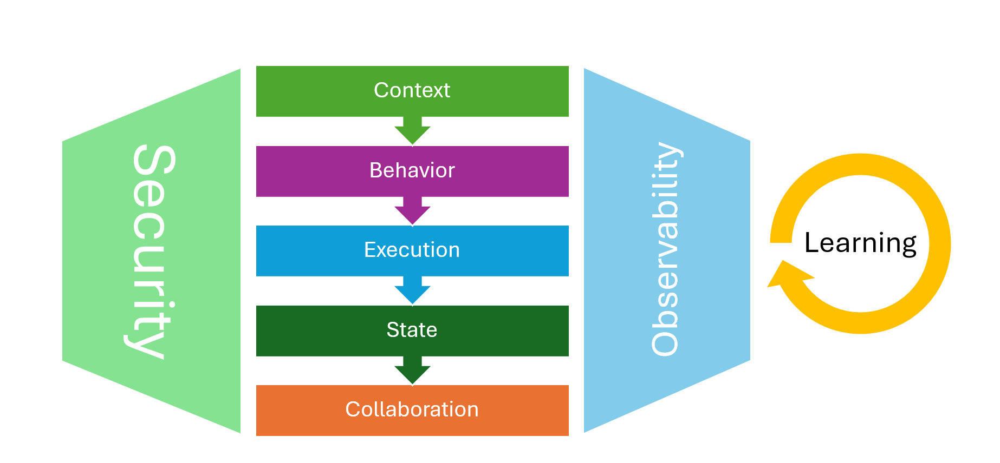
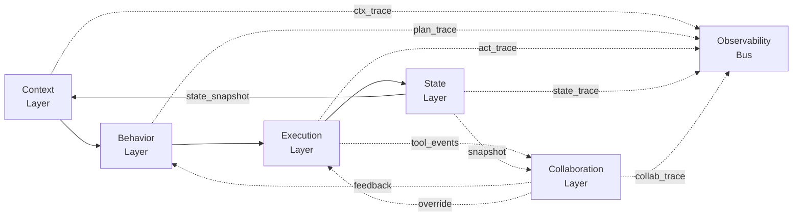

# 🧠 Compositional Agentic Architecture (CAA) & Arti Agent Stack

**Arti Agent Stack is built on the principles of Compositional Agentic Architecture (CAA)** — a modular, observable, collaboration-first approach to intelligent system design.  
This repo introduces the CAA philosophy, outlines its 5-layer architecture, and defines the 10 operational principles behind Arti's implementation.

## 🚀 Why CAA?

Chatbots answer questions. Enterprises need work done.  
Most agent frameworks are brittle, opaque, and stuck in the demo phase.  
CAA turns agents from toys into systems.

CAA defines five layers that turn LLM reasoning into reliable execution.

**CAA is a blueprint, not a framework.**  

| Layer | Solves | Delivers |
|-------|--------|----------|
| **Context** | AI doesn’t get intent | Typed, versioned context |
| **Behavior** | Reasoning is hidden | Explicit, inspectable plans |
| **Execution** | Chats but no action | Deterministic workflows & tool calls |
| **State** | AI forgets | Persistent, testable memory |
| **Collaboration** | No trust / approvals | Human-in-loop hooks |
| **Observability** (cross-cutting)| Opaque failures | Full tracing & metrics |
| **Security** (cross-cutting) | Risk & compliance gaps | Auth, isolation, governance |
| **Learning & Adaptation** (lifecycle) | Systems decay | Continuous improvement loop |

If you're building agents that need to survive contact with reality, start here. We’ve tested dozens of frameworks, shipped agent systems in production, and learned what works. This project distills that into a blueprint for real-world AI execution — not just chatbots and demos.

Overview



Diagram




## 🛠️ Using CAA with Your Existing Stack

**Already have a LangChain, Pydantic, or OpenAI codebase?**
You don't need to rewrite everything to get the benefits of Compositional Agentic Architecture.

CAA is a set of architectural patterns, not a rigid framework.
👉 **Read the [Integration Guide](integration-guide.md)** to see how to organize your existing tools (Pydantic, Redis, Celery) into robust agentic layers.

## ⚡ The 30-Second Concept

CAA replaces "one big prompt" with **specialized layers**:

```python
# Instead of: response = llm.chat(user_input)

# 1. Context Layer (Validate)
context = UserContext.from_input(user_input) # Enforces Pydantic Schema

# 2. Behavior Layer (Plan)
plan = planner.create_plan(context) # Deterministic steps, no execution yet

# 3. Execution Layer (Act)
result = executor.run(plan) # Safe tool use with contracts

# 4. State Layer (Remember)
state.save(context, plan, result) # Persist to Redis
```

## Who Is This For?

*   **For Leaders & Product Managers:** Start with our [Product Overview](./product_overview.md) to understand the business value.
*   **For Architects & Engineers:** Dive into the [CAA Architectural Stack](./architecture.md) for the technical deep dive.
*   **For the Curious Reader:** Check the [Philosophy](./philosophy.md) to understand the motivation & background.


## Key Concepts

- **Execution-first AI** – Not chatbots. Not search. Agents that do.
- **Typed prompts and context** – No raw string stitching.
- **Composable behaviors** – One agent, one responsibility.
- **Separation of concerns** – Prompting ≠ tooling ≠ state.
- **Observability by design** – Trace every decision and step.

---
## 🏗️ The CAA Architectural Stack

CAA is not just a list of ideas; it's a structured, 5-layer stack designed for production realities. Each layer has a distinct responsibility, ensuring a clear separation of concerns.

*   [**Layer 1: Context**](./layers/01-context-layer.md) - Transforms raw data into a structured understanding, so the AI acts with full context, not guesswork.
*   [**Layer 2: Behavior**](./layers/02-behavior-layer.md) - The "planner" that decides *what* to do next, creating an explicit, inspectable execution plan.
*   [**Layer 3: Execution**](./layers/03-execution-layer.md) - The "engine room" that reliably performs the actions and calls the tools defined in the plan.
*   [**Layer 4: State**](./layers/04-state-layer.md)** - The persistent memory that tracks the agent's progress and enables multi-step, resumable workflows.
*   [**Layer 5: Collaboration**](./layers/05-collaboration-layer.md)** - The interface that puts humans in the loop for approvals, oversight, and safe operations.

Plus, 2 cross-cutting concern that touches every layer:

*   [**The Observability Bus**](./layers/06-observability-layer.md) - Provides the full tracing, metrics, and debugging capabilities required to trust the system in production.
*   **Security** - Authentication, isolation, compliance, governance.

and a Lifecycle concern:
*   **Learning & Adaptation** - Continuous improvement from feedback, monitoring, and retraining.


## 🔷 Compositional Agentic Architecture (CAA)

It defines what agentic systems *should* be: structured, semantic, observable, and designed for human-AI collaboration.

In a world full of fragile demos and prompt loops, CAA sets the architectural foundation for scalable, production-grade AI systems.


## 🧩 Arti Agent Stack

The **Arti Agent Stack** is our opinionated implementation of CAA — forged through real-world deployment in high-stakes environments.

It is one way to implement the blueprint — not the only way.

*  Arti provides:
*  First-class support for context versioning
*  Deterministic execution with retries and validation
*  State persistence for long-running workflows
*  Human-in-loop hooks for approvals and escalations
*  Observability baked in (tracing, metrics, dashboards)


## 🔟 10 Principles of the Arti Agent Stack

These are the design rules that make the Arti Stack robust, modular, and production-ready:

1. [**Small, Focused Agents**](principles/01-small-focused-agents.md)  
   - One agent, one responsibility. Scope tightly.

2. [**Separation of Concerns**](principles/02-separation-of-concerns.md)
   - Divide prompting, tool logic, memory, context, and execution.  
   - No monoliths. No entangled loops.

3. [**Explicit Control Flow**](principles/03-explicit-control-flow.md)
   - Execution should be defined, inspectable, and testable — not inferred.

4. [**Structured Context**](principles/04-structured-context.md)
   - No string soup. Use typed, versioned context builders.

5. [**Prompt = Code**](principles/05-prompt-management.md)
   - Prompts are versioned, parameterized, testable, and fallback-safe.

6. [**Tools as Contracts**](principles/06-tools-as-contracts.md)
   - Tools have typed interfaces, clear intent, and predictable side effects.

7. [**Observable Everything**](principles/07-observable-everything.md)
   - Every agent step must be traced, debugged, and explainable.

8. [**State is Explicit**](principles/08-state-is-explicit.md)
   - No loose dicts or memory blobs. Use structured, persistent agent state.

9. [**Composable Error Handling**](principles/09-composable-error-handling.md)
   - Treat failure like a system design concern. Retry, fallback, escalate.

10. [**Human Collaboration by Design**](principles/10-human-collaboration-by-design.md)
   - Support interruption, supervision, review, and override from the start.


## 📍 Roadmap

- [x] Visual diagrams of the CAA architecture and Arti stack
- [x] Integration Guide for existing tools
- [x] Core Interface Definitions (See /src)
- [ ] Example: Industrial Support Agent


---

## 📖 Learn More

**The Thinking Behind the Stack**  
Read our [Philosophy](./philosophy.md) to understand the core principles behind CAA and how they evolved from real-world production challenges.

**Deep Dive Blog Series**  
We’re documenting our journey, lessons, and frameworks in a [multi-part blog series](https://www.artiquare.com/blog/). Start with [“The Workforce Challenges in Complex & Technical Industries”](https://www.artiquare.com/ai-workforce-augmentation-workforce-challenges/) for the why — and follow the trail to the how.

---


## 🚀 Get Involved

**Follow the Project**  
We’re evolving the Arti Agent Stack and Compositional Agentic Architecture in the open. 

**See It in Action**  
We're using this stack to power real-world agentic systems in complex industrial environments. Demos and case studies coming soon — follow us on [LinkedIn](https://www.linkedin.com/company/artiquare) or check out [website](https://www.artiquare.com/) for updates.

**Contribute or Collaborate**  
Have thoughts, ideas, or real use cases to share? Please follow the guidelines [here](./CONTRIBUTING.md).


**Let’s build the cognitive layer for enterprise AI.**
