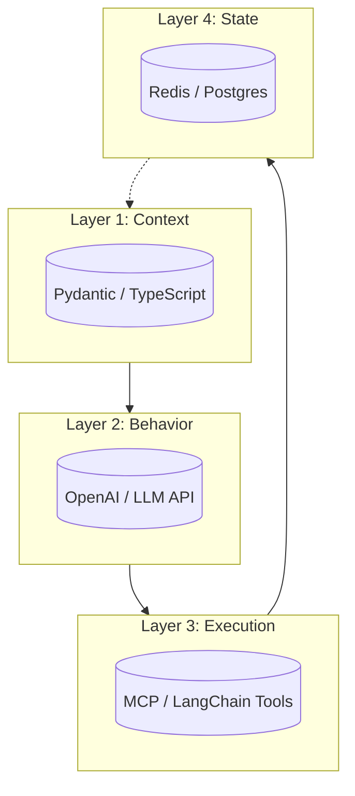

# CAA Integration Guide: Using Your Existing Tools

## Introduction

**CAA is not a framework. It's architectural principles.**

You don't need to replace your stack to adopt CAA. You need to organize what you already have.

This guide shows how CAA layers map to tools you're likely already using - and where the gaps actually are.

---

## The Core Principle

**CAA defines responsibilities. Your tools fulfill them.**

| CAA Layer | Responsibility | Common Tools | What CAA Adds |
|-----------|---------------|--------------|---------------|
| Context | Typed, validated inputs | Pydantic, TypeScript, Protobuf | Schema versioning, drift detection |
| Behavior | Explicit planning | LLM APIs, ReAct, Chain-of-Thought | Inspectable plans, deterministic paths |
| Execution | Tool orchestration | Function calling, MCP, LangChain tools | Contracts, validation, rollback |
| State | Persistence | Redis, Postgres, SQLite, DynamoDB | Structured schemas, checkpointing |
| Collaboration | Human-in-loop | Webhooks, queues, approval systems | Escalation logic, override patterns |
| Observability | Tracing & metrics | Langfuse, LangSmith, OpenTelemetry | Per-layer boundaries, failure taxonomy |

**The pattern:** CAA tells you *what* to do. Your tools tell you *how*.

---

## Layer-by-Layer Integration



### Layer 1: Context

**What CAA requires:**
- Typed context structures
- Version control for context schemas
- Validation before model sees it

**Tools that work:**

```python
# Using Pydantic (Python)
from pydantic import BaseModel, Field, field_validator

class UserContext(BaseModel):
    user_id: str
    industry: str = Field(..., description="NAICS code")
    query: str
    metadata: dict = {}
    # Explicit versioning is a great CAA touch
    schema_version: str = "1.2.0" 
    
    @field_validator('industry')
    @classmethod
    def validate_industry(cls, v: str) -> str:
        if not v.startswith('NAICS'):
            raise ValueError('Industry must be a valid NAICS code')
        return v

# Using TypeScript
interface UserContext {
  userId: string;
  industry: string; // NAICS code
  query: string;
  metadata: Record<string, any>;
  version: "1.2.0";
}
```

**Integration pattern:**
1. Define context schema with versioning
2. Validate all inputs before passing to Behavior Layer
3. Log context snapshots for debugging

**Tools:** Pydantic, TypeScript, Zod, JSON Schema, Protobuf

**CAA additions you need to build:**
- Context version registry
- Schema migration logic
- Drift detection (when real inputs don't match schema)

---

### Layer 2: Behavior

**What CAA requires:**
- Explicit, inspectable plans
- Separation of planning from execution
- Deterministic reasoning paths

**Tools that work:**

```python
# Using OpenAI function calling for planning
from openai import OpenAI

client = OpenAI()

# CAA: Planning is separate from execution
def create_plan(context: UserContext) -> Plan:
    response = client.chat.completions.create(
        model="gpt-5-mini",
        messages=[
            {"role": "system", "content": PLANNING_PROMPT},
            {"role": "user", "content": context.to_prompt()}
        ],
        tools=[
            {
                "type": "function",
                "function": {
                    "name": "create_step",
                    "description": "Add a step to execution plan",
                    "parameters": StepSchema.to_json_schema()
                }
            }
        ]
    )
    
    # Plan is now inspectable, not hidden in tool calls
    return Plan.from_response(response)
```

**Integration pattern:**
1. LLM generates plan as structured output
2. Plan is validated (does it make sense? allowed actions?)
3. Plan is logged/stored before execution
4. Execution Layer runs the plan deterministically

**Tools:** OpenAI/Anthropic function calling, LangGraph, Instructor, Marvin

**CAA additions you need:**
- Plan validation logic
- Plan versioning (what plan was executed when?)
- Plan templates for common workflows

---

### Layer 3: Execution

**What CAA requires:**
- Tool contracts (typed inputs/outputs)
- Validation before execution
- Failure handling and rollback

**Tools that work:**

```python
from typing import Protocol, Any

class ToolProtocol(Protocol):
    name: str
    def execute(self, params: dict) -> Any: ...

# CAA: Wrap tools with contracts
class CAAToolExecutor:
    def __init__(self, mcp_tool: Tool):
        self.tool = mcp_tool
        self.contract = ToolContract.from_mcp(mcp_tool)
    
    async def execute(self, params: dict, context: Context) -> ExecutionResult:
        # 1. Validate against contract
        validated_params = self.contract.validate(params)
        
        # 2. Execute with timeout
        try:
            result = await asyncio.wait_for(
                self.tool.call(validated_params),
                timeout=self.contract.timeout
            )
        except TimeoutError:
            return ExecutionResult.failure("timeout")
        except Exception as e:
            return ExecutionResult.failure(str(e))
        
        # 3. Validate output
        validated_result = self.contract.validate_output(result)
        
        # 4. Return structured result
        return ExecutionResult(
            tool=self.tool.name,
            input=params,
            output=validated_result,
            context_id=context.id,
            timestamp=datetime.now()
        )
```

**Integration pattern:**
1. Define tool contracts (input/output types, constraints)
2. Wrap existing tools (MCP, LangChain, custom APIs)
3. Validate before and after execution
4. Structure all results for observability

**Tools:** MCP, LangChain tools, OpenAI function calling, custom APIs

**CAA additions you need:**
- Tool contract definitions
- Validation layer
- Retry/fallback logic
- Execution result schema

---

### Layer 4: State

**What CAA requires:**
- Structured state schemas
- Persistence across steps
- Checkpointing for resumability

**Tools that work:**

```python
# Using Redis for state
import redis
from pydantic import BaseModel

class AgentState(BaseModel):
    agent_id: str
    conversation_id: str
    current_step: int
    plan: Plan
    executed_steps: List[ExecutionResult]
    context_snapshot: Context
    
    class Config:
        # Pydantic v2
        json_schema_extra = {"version": "1.0.0"}

class StateManager:
    def __init__(self, redis_client: redis.Redis):
        self.redis = redis_client
    
    def save_checkpoint(self, state: AgentState):
        key = f"agent:{state.agent_id}:state"
        self.redis.set(key, state.json())
        self.redis.expire(key, 86400)  # 24h TTL
    
    def load_checkpoint(self, agent_id: str) -> AgentState:
        key = f"agent:{agent_id}:state"
        data = self.redis.get(key)
        return AgentState.parse_raw(data)
    
    def resume_from_step(self, agent_id: str, step: int):
        state = self.load_checkpoint(agent_id)
        state.current_step = step
        return state
```

**Integration pattern:**
1. Define state schema (Pydantic, TypeScript)
2. Save checkpoints after each step
3. Enable resumability from any step
4. Version state schemas

**Tools:** Redis, Postgres, SQLite, DynamoDB, MongoDB

**CAA additions you need:**
- State schema definitions
- Checkpoint strategy (when to save?)
- State versioning
- Migration logic for schema changes

---

### Layer 5: Collaboration

**What CAA requires:**
- Human approval gates
- Escalation triggers
- Override mechanisms

**Tools that work:**

```python
# Using webhooks + queues
from fastapi import FastAPI
from celery import Celery

app = FastAPI()
celery = Celery('tasks', broker='redis://localhost')

class CollaborationLayer:
    def __init__(self, webhook_url: str):
        self.webhook_url = webhook_url
    
    async def request_approval(
        self, 
        plan: Plan, 
        context: Context,
        reason: str
    ) -> ApprovalResult:
        # Send to human
        approval_id = str(uuid.uuid4())
        await self.send_notification({
            "approval_id": approval_id,
            "plan": plan.dict(),
            "context": context.dict(),
            "reason": reason,
            "approve_url": f"{self.webhook_url}/approve/{approval_id}",
            "reject_url": f"{self.webhook_url}/reject/{approval_id}"
        })
        
        # Wait for response (with timeout)
        result = await self.wait_for_approval(approval_id, timeout=3600)
        return result

@app.post("/approve/{approval_id}")
async def approve_step(approval_id: str, modifications: Optional[dict] = None):
    # Resume agent with approval
    celery.send_task('resume_agent', args=[approval_id, True, modifications])
    return {"status": "approved"}
```

**Integration pattern:**
1. Identify high-risk steps in plan
2. Pause execution, send notification
3. Wait for human response
4. Resume with approval (or modifications)

**Tools:** Webhooks, Slack/Teams APIs, email, queues (Celery, RabbitMQ), workflow engines

**CAA additions you need:**
- Approval rule definitions (what needs approval?)
- Notification templates
- Timeout handling
- Override logging

---

### Cross-Cutting: Observability

**What CAA requires:**
- Trace every layer boundary
- Log decisions and state changes
- Enable debugging of failures

**Tools that work:**

```python
# Using Langfuse
from langfuse import Langfuse

langfuse = Langfuse()

class ObservableAgent:
    def run(self, user_input: str):
        trace = langfuse.trace(name="agent_execution")
        
        # Context Layer
        with trace.span(name="context_construction") as span:
            context = self.build_context(user_input)
            span.update(
                input={"raw": user_input},
                output=context.dict(),
                metadata={"version": context.version}
            )
        
        # Behavior Layer
        with trace.span(name="planning") as span:
            plan = self.create_plan(context)
            span.update(
                input=context.dict(),
                output=plan.dict(),
                metadata={"plan_id": plan.id}
            )
        
        # Execution Layer
        for i, step in enumerate(plan.steps):
            with trace.span(name=f"execute_step_{i}") as span:
                result = self.execute_step(step)
                span.update(
                    input=step.dict(),
                    output=result.dict(),
                    metadata={"tool": step.tool}
                )
        
        trace.update(
            output={"status": "complete"},
            metadata={"total_steps": len(plan.steps)}
        )
```

**Integration pattern:**
1. Wrap each layer with observability spans
2. Log inputs/outputs at layer boundaries
3. Tag with layer name and version
4. Enable filtering by layer for debugging

**Tools:** Langfuse, LangSmith, OpenTelemetry, Datadog, custom logging

**CAA additions you need:**
- Layer boundary definitions
- Failure taxonomy (which layer failed?)
- Trace aggregation for multi-agent systems

---

### Cross-Cutting: Security

**What CAA requires:**
- Authentication for tool access
- PII filtering in context
- Audit trails for actions

**Tools that work:**

```python
# Using standard auth + PII detection
from typing import Any
import re

class SecurityLayer:
    def __init__(self, auth_provider, pii_detector):
        self.auth = auth_provider
        self.pii = pii_detector
    
    def sanitize_context(self, context: Context) -> Context:
        # Remove PII before model sees it
        sanitized = context.copy()
        sanitized.query = self.pii.redact(context.query)
        sanitized.metadata = self.pii.redact_dict(context.metadata)
        return sanitized
    
    def authorize_tool(self, tool: str, user: User) -> bool:
        # Check if user can execute this tool
        return self.auth.has_permission(user, f"tool.{tool}.execute")
    
    def log_action(self, user: User, tool: str, params: dict, result: Any):
        # Audit trail
        audit_log.write({
            "user": user.id,
            "tool": tool,
            "timestamp": datetime.now(),
            "params": self.sanitize_for_audit(params),
            "success": result.success
        })
```

**Integration pattern:**
1. Filter PII in Context Layer
2. Check permissions in Execution Layer
3. Log all actions with user attribution

**Tools:** OAuth providers, Presidio (PII detection), audit logging services

**CAA additions you need:**
- PII detection rules
- Permission model for tools
- Audit log schema

---

## What You Still Need to Build

**CAA provides the architecture. You fill these gaps:**

1. **Context schema registry** - Track versions, migrations
2. **Plan validation logic** - Is this plan safe? Allowed?
3. **Tool contract definitions** - Input/output types per tool
4. **State versioning** - Handle schema evolution
5. **Approval rules engine** - What triggers human review?
6. **Failure taxonomy** - Categorize errors by layer
7. **Integration glue** - Connect your specific tools

**These are thin layers, not frameworks.**

Most are <100 lines of code once you know what you're building.

---

## Migration Path: From Chatbot to CAA

**You don't rewrite. You refactor in stages.**

### Stage 1: Add Context Layer
```python
# Before
response = llm.chat(user_input)

# After - Add typing
context = UserContext.from_input(user_input)
response = llm.chat(context.to_prompt())
```

### Stage 2: Separate Planning
```python
# Before
response = llm.chat(context, tools=all_tools)

# After - Explicit plan
plan = planner.create_plan(context)
results = executor.run_plan(plan)
```

### Stage 3: Add State
```python
# Before
# (everything in memory, lost on restart)

# After - Checkpointing
state.save_checkpoint(agent_id, plan, results)
# Now resumable
```

### Stage 4: Add Collaboration
```python
# Before
result = execute_tool(risky_action)

# After - Approval gate
if plan.requires_approval(step):
    approved = await collab.request_approval(step)
    if not approved:
        return
result = execute_tool(step)
```

### Stage 5: Add Observability
```python
# Before
# (print statements, maybe)

# After - Structured tracing
with trace.span(name="planning"):
    plan = planner.create_plan(context)
```

**Key insight:** Each stage adds value independently. You don't need all 5 layers on day one.

---

## Example: Full Integration

**Scenario:** Support ticket routing agent

**Stack:**
- Context: Pydantic
- Behavior: OpenAI function calling
- Execution: MCP tools (Jira, Slack, email)
- State: Postgres
- Collaboration: Slack webhooks
- Observability: Langfuse

**Code structure:**
```
support_agent/
├── context/
│   ├── schemas.py          # Pydantic models
│   └── builders.py         # Context construction
├── behavior/
│   ├── planner.py          # OpenAI planning logic
│   └── templates.py        # Prompt templates
├── execution/
│   ├── tools.py            # MCP tool wrappers
│   └── contracts.py        # Tool validation
├── state/
│   ├── models.py           # State schemas
│   └── persistence.py      # Postgres integration
├── collaboration/
│   ├── approvals.py        # Slack webhook handlers
│   └── notifications.py    # Message templates
└── observability/
    ├── tracing.py          # Langfuse integration
    └── metrics.py          # Custom metrics
```

**Total new code:** ~800 lines
**Existing tools used:** All of them
**New dependencies:** 0 (just integration code)

---

## Common Patterns

### Pattern 1: Wrapping Existing Frameworks

```python
# Adapting LangChain to CAA
from langchain.agents import AgentExecutor

class CAAAgentAdapter:
    def __init__(self, langchain_agent: AgentExecutor):
        self.agent = langchain_agent
    
    def run_with_caa(self, user_input: str):
        # Context Layer
        context = self.build_context(user_input)
        
        # Behavior Layer (extract plan from LangChain)
        intermediate_steps = []
        result = self.agent.run(
            context.to_prompt(),
            callbacks=[PlanExtractor(intermediate_steps)]
        )
        plan = Plan.from_intermediate_steps(intermediate_steps)
        
        # State Layer
        self.state.save(plan, result)
        
        # Observability
        self.trace.log(context, plan, result)
        
        return result
```

### Pattern 2: Multi-Agent Composition

```python
# Each agent follows CAA, coordinated by orchestrator
class Orchestrator:
    def __init__(self):
        self.agents = {
            "triage": TriageAgent(),      # Routes tickets
            "research": ResearchAgent(),  # Finds solutions
            "response": ResponseAgent()   # Writes replies
        }
    
    def process_ticket(self, ticket: Ticket):
        # Each agent has Context → Behavior → Execution → State
        
        # Agent 1: Triage
        context = TicketContext.from_ticket(ticket)
        category = self.agents["triage"].run(context)
        
        # Agent 2: Research
        research_context = ResearchContext(ticket, category)
        solution = self.agents["research"].run(research_context)
        
        # Agent 3: Response
        response_context = ResponseContext(ticket, solution)
        reply = self.agents["response"].run(response_context)
        
        # Orchestrator maintains overall state
        self.state.save_workflow(ticket.id, [
            {"agent": "triage", "output": category},
            {"agent": "research", "output": solution},
            {"agent": "response", "output": reply}
        ])
```

---

## Frequently Asked Questions

**Q: Do I need to use all 5 layers?**
A: No. Start with Context + Execution. Add others as complexity grows.

**Q: Can I use framework X with CAA?**
A: Yes. CAA is architecture, not implementation. LangChain, LlamaIndex, custom—all work.

**Q: What if my tool doesn't fit the contract pattern?**
A: Wrap it. Add validation. Structure the output. That's the adapter pattern.

**Q: Isn't this just over-engineering?**
A: For a chatbot, yes. For production systems with compliance requirements, no.

**Q: What's the minimum viable CAA agent?**
A: Context (typed input) + Execution (one tool with contract) + Observability (basic logging). ~50 lines.

---

## Next Steps

1. **Audit your current system** - Which layers exist? Which are missing?
2. **Pick one layer to add** - Usually Context (easiest) or Observability (highest ROI)
3. **Start small** - One agent, one workflow
4. **Measure improvement** - Fewer errors? Faster debugging? Better compliance?
5. **Expand gradually** - Add layers as you prove value

**CAA is a journey, not a rewrite.**

---

## Resources

- [CAA Philosophy](philosophy.md) - Why these layers matter
- [Reference Implementation](link) - Minimal agent showing all layers
- [Integration Examples](link) - Real code for common tools
- [Migration Guide](link) - Step-by-step refactoring path

**Remember:** CAA isn't about replacing your tools. It's about organizing them so your agents survive production.